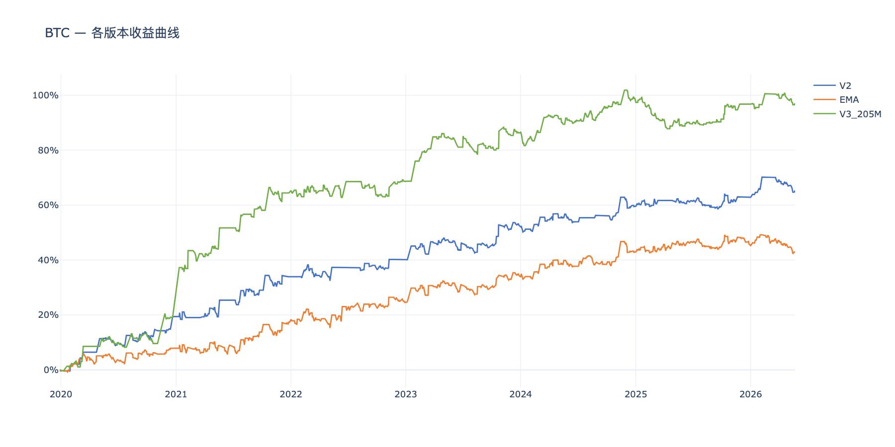
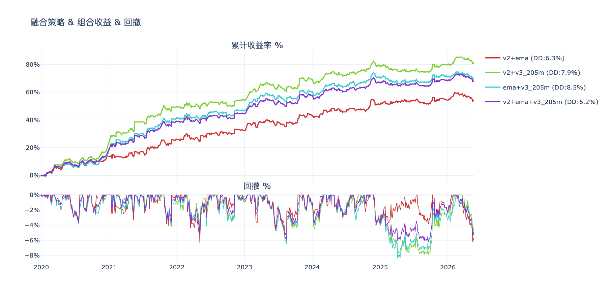
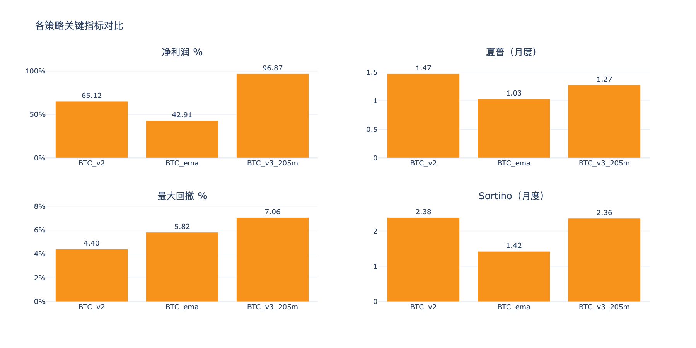
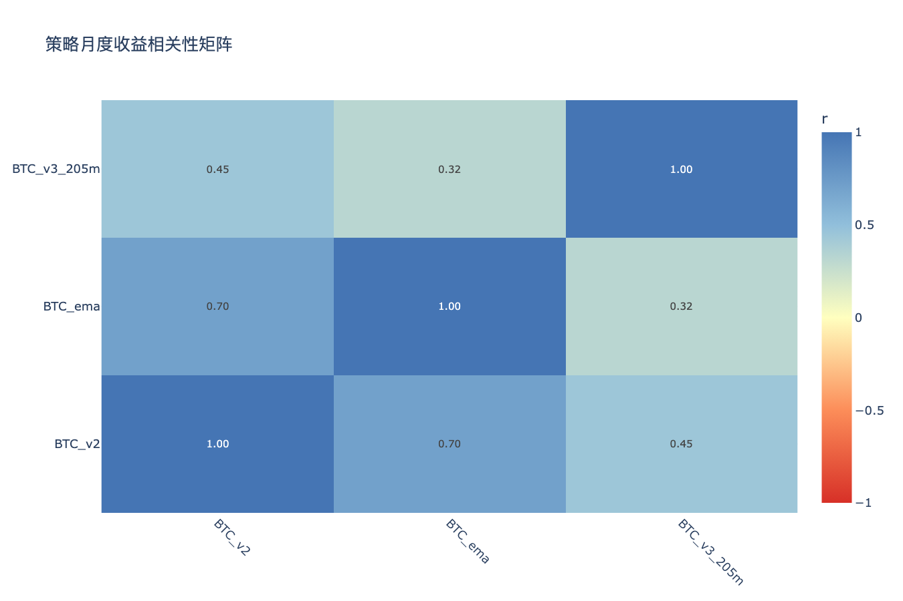

# BTC多版本策略分析 — 分析结论

生成时间：2026-05-22

---

## 收益曲线总览

## 组合收益 & 回撤

## 关键指标对比

## 相关性矩阵

---

## 各策略表现

| 策略 | 净利润 % | 年化收益 % | 夏普 | Sortino | 最大回撤 % | 月胜率 % |
|------|---------|-----------|------|---------|-----------|---------|
| BTC_ema | 42.9% | 5.7% | 1.03 | 1.42 | 6.9% | 54% |
| BTC_v2 | 65.1% | 8.1% | 1.47 | 2.38 | 5.8% | 61% |
| BTC_v3_205m | 96.8% | 11.1% | 1.27 | 2.36 | 14.1% | 59% |

## 年度收益分解

| 策略 | 2019 | 2020 | 2021 | 2022 | 2023 | 2024 | 2025 | 2026 |
|------|------|------|------|------|------|------|------|------|
| BTC_ema | -0.4% | +8.3% | +10.3% | +6.4% | +9.5% | +8.9% | +2.3% | -2.4% |
| BTC_v2 | -0.4% | +19.8% | +14.5% | +6.3% | +12.1% | +7.2% | +3.4% | +2.1% |
| BTC_v3_205m | — | +19.2% | +46.0% | +3.4% | +17.7% | +11.5% | -1.1% | +0.1% |

## 交易统计

| 策略 | 总交易数 | 胜率 % | 盈亏比 | 平均持仓K线 | 最大连续亏损 |
|------|---------|-------|-------|-----------|------------|
| BTC_ema | 917 | 31.8% | 2.65 | 7 | 14 |
| BTC_v2 | 707 | 31.5% | 3.23 | 8 | 14 |
| BTC_v3_205m | 970 | 23.8% | 4.95 | 17 | 21 |

## 组合对比（按最大回撤排序）

| 组合 | 净利润 % | 最大回撤 % | 夏普 | 回撤/收益 |
|------|---------|-----------|------|---------|
| v2+ema+v3_205m | 68.3% | 6.2% | 1.51 | 0.09 |
| v2+ema | 54.0% | 6.3% | 1.31 | 0.12 |
| v2+v3_205m | 81.0% | 7.9% | 1.53 | 0.10 |
| ema+v3_205m | 69.9% | 8.5% | 1.39 | 0.12 |

## 策略相关性

**高相关策略对（|r| > 0.6，组合分散效果有限）：**

| 策略 A | 策略 B | 相关系数 |
|--------|--------|---------|
| BTC_v2 | BTC_ema | 0.703 |

**低相关策略对（|r| ≤ 0.6，适合组合）：**

| 策略 A | 策略 B | 相关系数 |
|--------|--------|---------|
| BTC_ema | BTC_v3_205m | 0.318 |
| BTC_v2 | BTC_v3_205m | 0.446 |

## 关键发现

- **夏普最高**：BTC_v2（1.47）
- **回撤最小**：BTC_v2（5.8%）
- **最优组合（回撤最小）**：v2+ema+v3_205m（回撤 6.2%，净利润 68.3%）
- **注意**：BTC_v2×BTC_ema 相关性较高，同时持有分散效果有限

> 交互图表见同目录 HTML 文件。