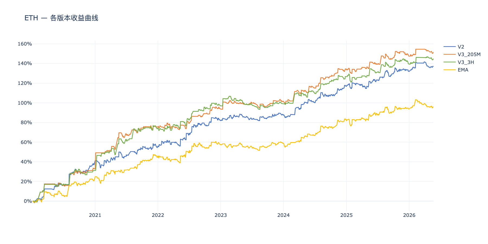
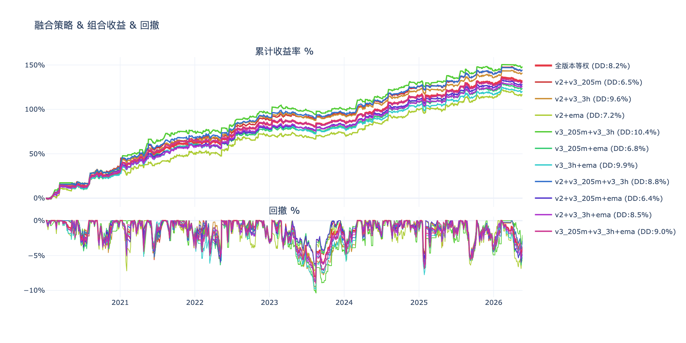
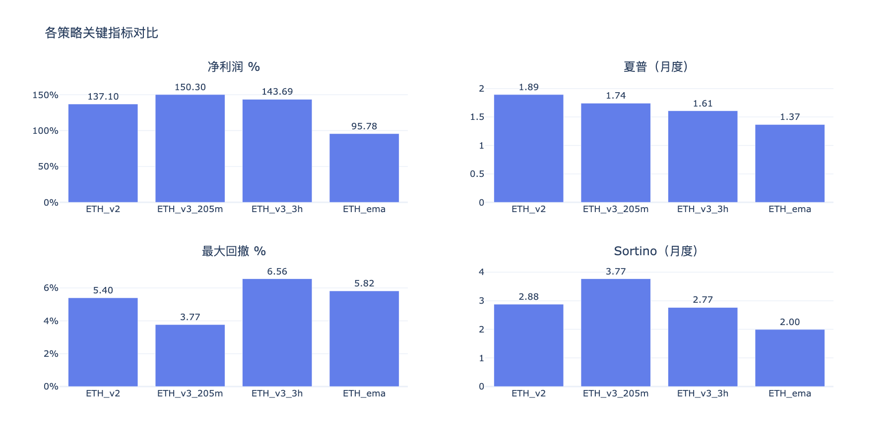
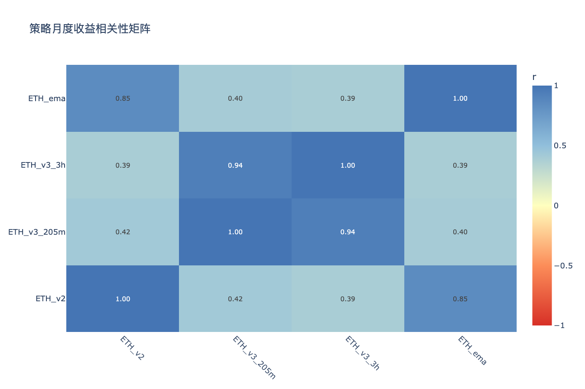

# ETH多版本策略分析 — 分析结论

生成时间：2026-05-22

---

## 收益曲线总览

## 组合收益 & 回撤

## 关键指标对比

## 相关性矩阵

---

## 各策略表现

| 策略 | 净利润 % | 年化收益 % | 夏普 | Sortino | 最大回撤 % | 月胜率 % |
|------|---------|-----------|------|---------|-----------|---------|
| ETH_ema | 95.8% | 11.1% | 1.37 | 2.00 | 9.0% | 65% |
| ETH_v2 | 137.1% | 14.4% | 1.89 | 2.88 | 7.5% | 68% |
| ETH_v3_205m | 151.6% | 15.4% | 1.74 | 3.77 | 7.3% | 63% |
| ETH_v3_3h | 145.0% | 14.9% | 1.61 | 2.77 | 13.5% | 64% |

## 年度收益分解

| 策略 | 2020 | 2021 | 2022 | 2023 | 2024 | 2025 | 2026 |
|------|------|------|------|------|------|------|------|
| ETH_ema | +20.8% | +25.1% | +11.4% | +1.4% | +23.3% | +11.6% | +2.1% |
| ETH_v2 | +37.1% | +18.8% | +26.0% | +5.8% | +29.1% | +15.1% | +5.2% |
| ETH_v3_205m | +32.8% | +42.7% | +18.2% | +7.9% | +32.9% | +13.0% | +4.2% |
| ETH_v3_3h | +31.3% | +43.2% | +22.3% | +2.4% | +27.4% | +12.7% | +5.7% |

## 交易统计

| 策略 | 总交易数 | 胜率 % | 盈亏比 | 平均持仓K线 | 最大连续亏损 |
|------|---------|-------|-------|-----------|------------|
| ETH_ema | 926 | 32.6% | 2.92 | 7 | 15 |
| ETH_v2 | 983 | 31.3% | 3.44 | 7 | 13 |
| ETH_v3_205m | 842 | 25.6% | 5.46 | 15 | 22 |
| ETH_v3_3h | 904 | 24.1% | 5.49 | 17 | 23 |

## 组合对比（按最大回撤排序）

| 组合 | 净利润 % | 最大回撤 % | 夏普 | 回撤/收益 |
|------|---------|-----------|------|---------|
| v2+v3_205m+ema | 128.2% | 6.4% | 2.00 | 0.05 |
| v2+v3_205m | 144.3% | 6.5% | 2.14 | 0.04 |
| v3_205m+ema | 123.7% | 6.8% | 1.86 | 0.05 |
| v2+ema | 116.4% | 7.2% | 1.70 | 0.06 |
| 全版本等权 | 132.4% | 8.2% | 1.99 | 0.06 |
| v2+v3_3h+ema | 126.0% | 8.5% | 1.95 | 0.07 |
| v2+v3_205m+v3_3h | 144.6% | 8.8% | 2.01 | 0.06 |
| v3_205m+v3_3h+ema | 130.8% | 9.0% | 1.82 | 0.07 |
| v2+v3_3h | 141.0% | 9.6% | 2.07 | 0.07 |
| v3_3h+ema | 120.4% | 9.9% | 1.78 | 0.08 |
| v3_205m+v3_3h | 148.3% | 10.4% | 1.70 | 0.07 |

## 策略相关性

**高相关策略对（|r| > 0.6，组合分散效果有限）：**

| 策略 A | 策略 B | 相关系数 |
|--------|--------|---------|
| ETH_v3_205m | ETH_v3_3h | 0.935 |
| ETH_v2 | ETH_ema | 0.846 |

**低相关策略对（|r| ≤ 0.6，适合组合）：**

| 策略 A | 策略 B | 相关系数 |
|--------|--------|---------|
| ETH_v3_3h | ETH_ema | 0.389 |
| ETH_v2 | ETH_v3_3h | 0.392 |
| ETH_v3_205m | ETH_ema | 0.404 |
| ETH_v2 | ETH_v3_205m | 0.421 |

## 关键发现

- **夏普最高**：ETH_v2（1.89）
- **回撤最小**：ETH_v3_205m（7.3%）
- **最优组合（回撤最小）**：v2+v3_205m+ema（回撤 6.4%，净利润 128.2%）
- **注意**：ETH_v3_205m×ETH_v3_3h、ETH_v2×ETH_ema 相关性较高，同时持有分散效果有限

> 交互图表见同目录 HTML 文件。