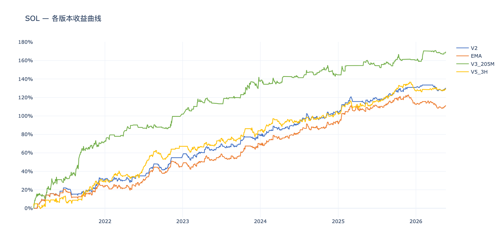
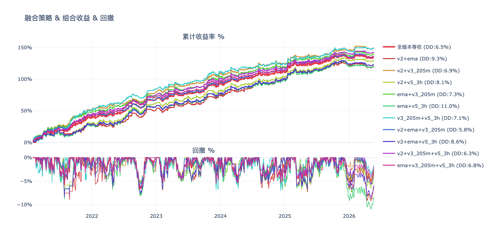
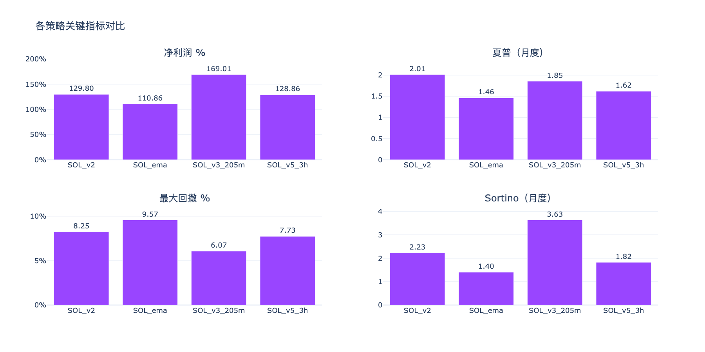
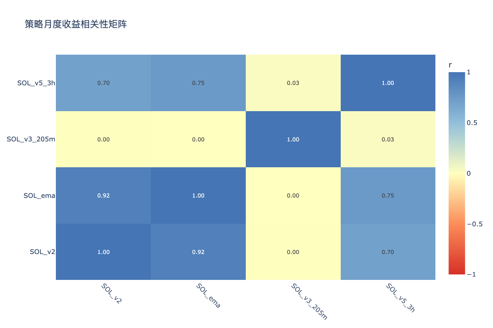

# SOL多版本策略分析 — 分析结论

生成时间：2026-05-22

---

## 收益曲线总览

## 组合收益 & 回撤

## 关键指标对比

## 相关性矩阵

---

## 各策略表现

| 策略 | 净利润 % | 年化收益 % | 夏普 | Sortino | 最大回撤 % | 月胜率 % |
|------|---------|-----------|------|---------|-----------|---------|
| SOL_ema | 111.4% | 15.0% | 1.46 | 1.40 | 14.8% | 75% |
| SOL_v2 | 130.4% | 16.9% | 2.01 | 2.23 | 8.3% | 77% |
| SOL_v3_205m | 169.1% | 20.4% | 1.85 | 3.63 | 12.1% | 67% |
| SOL_v5_3h | 129.3% | 16.8% | 1.62 | 1.82 | 10.5% | 71% |

## 年度收益分解

| 策略 | 2021 | 2022 | 2023 | 2024 | 2025 | 2026 |
|------|------|------|------|------|------|------|
| SOL_ema | +24.5% | +20.6% | +23.7% | +23.6% | +20.4% | -1.4% |
| SOL_v2 | +31.9% | +22.9% | +23.9% | +24.5% | +27.6% | -0.5% |
| SOL_v3_205m | +72.4% | +29.5% | +35.8% | +6.8% | +15.9% | +8.7% |
| SOL_v5_3h | +30.3% | +36.8% | +16.8% | +18.4% | +25.0% | +2.0% |

## 交易统计

| 策略 | 总交易数 | 胜率 % | 盈亏比 | 平均持仓K线 | 最大连续亏损 |
|------|---------|-------|-------|-----------|------------|
| SOL_ema | 965 | 37.5% | 2.26 | 6 | 13 |
| SOL_v2 | 832 | 38.5% | 2.40 | 6 | 13 |
| SOL_v3_205m | 899 | 31.8% | 3.29 | 13 | 16 |
| SOL_v5_3h | 1502 | 31.5% | 2.89 | 9 | 24 |

## 组合对比（按最大回撤排序）

| 组合 | 净利润 % | 最大回撤 % | 夏普 | 回撤/收益 |
|------|---------|-----------|------|---------|
| v2+ema+v3_205m | 137.0% | 5.8% | 2.45 | 0.04 |
| v2+v3_205m+v5_3h | 142.9% | 6.3% | 2.58 | 0.04 |
| 全版本等权 | 135.1% | 6.5% | 2.36 | 0.05 |
| ema+v3_205m+v5_3h | 136.6% | 6.8% | 2.35 | 0.05 |
| v2+v3_205m | 149.7% | 6.9% | 2.64 | 0.05 |
| v3_205m+v5_3h | 149.2% | 7.1% | 2.41 | 0.05 |
| ema+v3_205m | 140.3% | 7.3% | 2.36 | 0.05 |
| v2+v5_3h | 129.8% | 8.1% | 1.90 | 0.06 |
| v2+ema+v5_3h | 123.7% | 8.6% | 1.78 | 0.07 |
| v2+ema | 120.9% | 9.3% | 1.71 | 0.08 |
| ema+v5_3h | 120.4% | 11.0% | 1.64 | 0.09 |

## 策略相关性

**高相关策略对（|r| > 0.6，组合分散效果有限）：**

| 策略 A | 策略 B | 相关系数 |
|--------|--------|---------|
| SOL_v2 | SOL_ema | 0.923 |
| SOL_ema | SOL_v5_3h | 0.748 |
| SOL_v2 | SOL_v5_3h | 0.705 |

**低相关策略对（|r| ≤ 0.6，适合组合）：**

| 策略 A | 策略 B | 相关系数 |
|--------|--------|---------|
| SOL_ema | SOL_v3_205m | 0.001 |
| SOL_v2 | SOL_v3_205m | 0.003 |
| SOL_v3_205m | SOL_v5_3h | 0.029 |

## 关键发现

- **夏普最高**：SOL_v2（2.01）
- **回撤最小**：SOL_v2（8.3%）
- **最优组合（回撤最小）**：v2+ema+v3_205m（回撤 5.8%，净利润 137.0%）
- **注意**：SOL_v2×SOL_ema、SOL_ema×SOL_v5_3h、SOL_v2×SOL_v5_3h 相关性较高，同时持有分散效果有限

> 交互图表见同目录 HTML 文件。