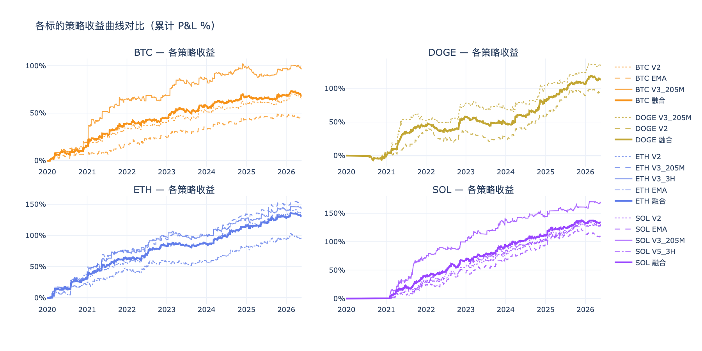
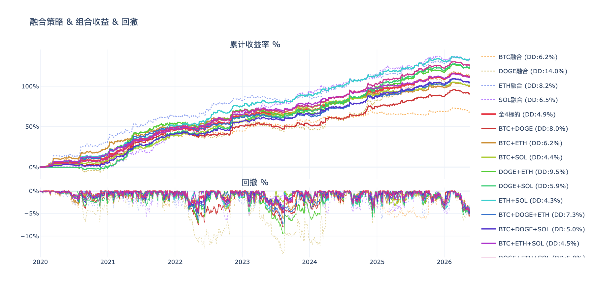
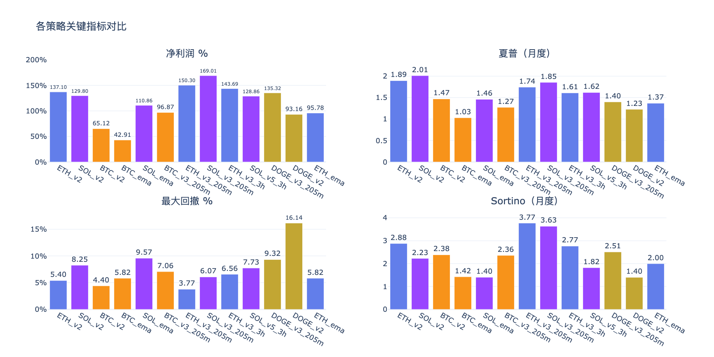
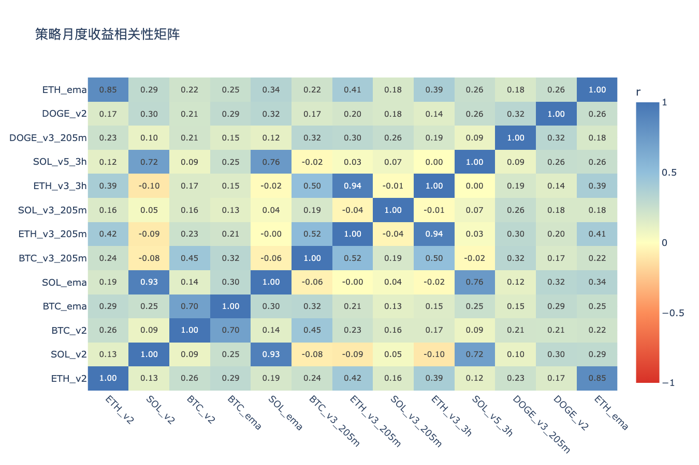

# 多标的策略分析 — 分析结论

生成时间：2026-05-22

---

## 收益曲线总览

## 组合收益 & 回撤

## 关键指标对比

## 相关性矩阵

---

## 各策略表现

| 策略 | 净利润 % | 年化收益 % | 夏普 | Sortino | 最大回撤 % | 月胜率 % |
|------|---------|-----------|------|---------|-----------|---------|
| BTC_ema | 42.9% | 5.7% | 1.03 | 1.42 | 6.9% | 54% |
| BTC_v2 | 65.1% | 8.1% | 1.47 | 2.38 | 5.8% | 61% |
| BTC_v3_205m | 96.8% | 11.1% | 1.27 | 2.36 | 14.1% | 59% |
| DOGE_v2 | 93.4% | 11.9% | 1.23 | 1.40 | 22.9% | 66% |
| DOGE_v3_205m | 135.3% | 15.7% | 1.40 | 2.51 | 15.8% | 58% |
| ETH_ema | 95.8% | 11.1% | 1.37 | 2.00 | 9.0% | 65% |
| ETH_v2 | 137.1% | 14.4% | 1.89 | 2.88 | 7.5% | 68% |
| ETH_v3_205m | 151.6% | 15.4% | 1.74 | 3.77 | 7.3% | 63% |
| ETH_v3_3h | 145.0% | 14.9% | 1.61 | 2.77 | 13.5% | 64% |
| SOL_ema | 111.4% | 15.0% | 1.46 | 1.40 | 14.8% | 75% |
| SOL_v2 | 130.4% | 16.9% | 2.01 | 2.23 | 8.3% | 77% |
| SOL_v3_205m | 169.1% | 20.4% | 1.85 | 3.63 | 12.1% | 67% |
| SOL_v5_3h | 129.3% | 16.8% | 1.62 | 1.82 | 10.5% | 71% |

## 年度收益分解

| 策略 | 2019 | 2020 | 2021 | 2022 | 2023 | 2024 | 2025 | 2026 |
|------|------|------|------|------|------|------|------|------|
| BTC_ema | -0.4% | +8.3% | +10.3% | +6.4% | +9.5% | +8.9% | +2.3% | -2.4% |
| BTC_v2 | -0.4% | +19.8% | +14.5% | +6.3% | +12.1% | +7.2% | +3.4% | +2.1% |
| BTC_v3_205m | — | +19.2% | +46.0% | +3.4% | +17.7% | +11.5% | -1.1% | +0.1% |
| DOGE_v2 | — | -2.9% | +41.8% | -2.1% | -10.4% | +32.3% | +30.7% | +3.9% |
| DOGE_v3_205m | — | -1.9% | +54.5% | +25.6% | -9.9% | +36.3% | +19.0% | +11.8% |
| ETH_ema | — | +20.8% | +25.1% | +11.4% | +1.4% | +23.3% | +11.6% | +2.1% |
| ETH_v2 | — | +37.1% | +18.8% | +26.0% | +5.8% | +29.1% | +15.1% | +5.2% |
| ETH_v3_205m | — | +32.8% | +42.7% | +18.2% | +7.9% | +32.9% | +13.0% | +4.2% |
| ETH_v3_3h | — | +31.3% | +43.2% | +22.3% | +2.4% | +27.4% | +12.7% | +5.7% |
| SOL_ema | — | — | +24.5% | +20.6% | +23.7% | +23.6% | +20.4% | -1.4% |
| SOL_v2 | — | — | +31.9% | +22.9% | +23.9% | +24.5% | +27.6% | -0.5% |
| SOL_v3_205m | — | — | +72.4% | +29.5% | +35.8% | +6.8% | +15.9% | +8.7% |
| SOL_v5_3h | — | — | +30.3% | +36.8% | +16.8% | +18.4% | +25.0% | +2.0% |

## 交易统计

| 策略 | 总交易数 | 胜率 % | 盈亏比 | 平均持仓K线 | 最大连续亏损 |
|------|---------|-------|-------|-----------|------------|
| BTC_ema | 917 | 31.8% | 2.65 | 7 | 14 |
| BTC_v2 | 707 | 31.5% | 3.23 | 8 | 14 |
| BTC_v3_205m | 970 | 23.8% | 4.95 | 17 | 21 |
| DOGE_v2 | 1152 | 32.8% | 2.65 | 6 | 18 |
| DOGE_v3_205m | 777 | 29.5% | 3.65 | 11 | 15 |
| ETH_ema | 926 | 32.6% | 2.92 | 7 | 15 |
| ETH_v2 | 983 | 31.3% | 3.44 | 7 | 13 |
| ETH_v3_205m | 842 | 25.6% | 5.46 | 15 | 22 |
| ETH_v3_3h | 904 | 24.1% | 5.49 | 17 | 23 |
| SOL_ema | 965 | 37.5% | 2.26 | 6 | 13 |
| SOL_v2 | 832 | 38.5% | 2.40 | 6 | 13 |
| SOL_v3_205m | 899 | 31.8% | 3.29 | 13 | 16 |
| SOL_v5_3h | 1502 | 31.5% | 2.89 | 9 | 24 |

## 各标的融合表现

| 组合 | 净利润 % | 最大回撤 % | 夏普 | Sortino |
|------|---------|-----------|------|---------|
| BTC融合 | 68.3% | 6.2% | 1.51 | 2.56 |
| DOGE融合 | 114.3% | 14.0% | 1.63 | 2.27 |
| ETH融合 | 132.4% | 8.2% | 1.99 | 3.72 |
| SOL融合 | 135.1% | 6.5% | 2.36 | 2.84 |

## 组合对比（按最大回撤排序）

| 组合 | 净利润 % | 最大回撤 % | 夏普 | 回撤/收益 |
|------|---------|-----------|------|---------|
| ETH+SOL | 133.7% | 4.3% | 2.72 | 0.03 |
| BTC+SOL | 101.7% | 4.4% | 2.38 | 0.04 |
| BTC+ETH+SOL | 111.9% | 4.5% | 2.69 | 0.04 |
| 全4标的 | 112.5% | 4.9% | 2.60 | 0.04 |
| BTC+DOGE+SOL | 105.9% | 5.0% | 2.34 | 0.05 |
| DOGE+ETH+SOL | 127.3% | 5.0% | 2.62 | 0.04 |
| DOGE+SOL | 124.7% | 5.9% | 2.34 | 0.05 |
| BTC融合 | 68.3% | 6.2% | 1.51 | 0.09 |
| BTC+ETH | 100.3% | 6.2% | 2.08 | 0.06 |
| SOL融合 | 135.1% | 6.5% | 2.36 | 0.05 |
| BTC+DOGE+ETH | 105.0% | 7.3% | 2.21 | 0.07 |
| BTC+DOGE | 91.3% | 8.0% | 1.83 | 0.09 |
| ETH融合 | 132.4% | 8.2% | 1.99 | 0.06 |
| DOGE+ETH | 123.4% | 9.5% | 2.17 | 0.08 |
| DOGE融合 | 114.3% | 14.0% | 1.63 | 0.12 |

## 策略相关性

**高相关策略对（|r| > 0.6，组合分散效果有限）：**

| 策略 A | 策略 B | 相关系数 |
|--------|--------|---------|
| ETH_v3_205m | ETH_v3_3h | 0.935 |
| SOL_v2 | SOL_ema | 0.925 |
| ETH_v2 | ETH_ema | 0.846 |
| SOL_ema | SOL_v5_3h | 0.756 |
| SOL_v2 | SOL_v5_3h | 0.717 |
| BTC_v2 | BTC_ema | 0.703 |

**低相关策略对（|r| ≤ 0.6，适合组合）：**

| 策略 A | 策略 B | 相关系数 |
|--------|--------|---------|
| ETH_v3_3h | SOL_v5_3h | 0.001 |
| SOL_ema | ETH_v3_205m | -0.004 |
| SOL_v3_205m | ETH_v3_3h | -0.012 |
| SOL_ema | ETH_v3_3h | -0.017 |
| BTC_v3_205m | SOL_v5_3h | -0.021 |
| ETH_v3_205m | SOL_v5_3h | 0.033 |
| SOL_ema | SOL_v3_205m | 0.037 |
| ETH_v3_205m | SOL_v3_205m | -0.045 |

## 关键发现

- **夏普最高**：SOL_v2（2.01）
- **回撤最小**：BTC_v2（5.8%）
- **最优组合（回撤最小）**：ETH+SOL（回撤 4.3%，净利润 133.7%）
- **注意**：ETH_v3_205m×ETH_v3_3h、SOL_v2×SOL_ema、ETH_v2×ETH_ema 相关性较高，同时持有分散效果有限

> 交互图表见同目录 HTML 文件。