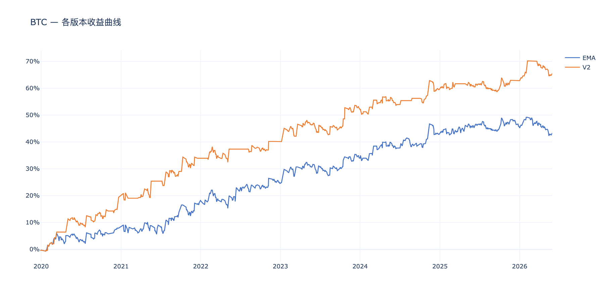
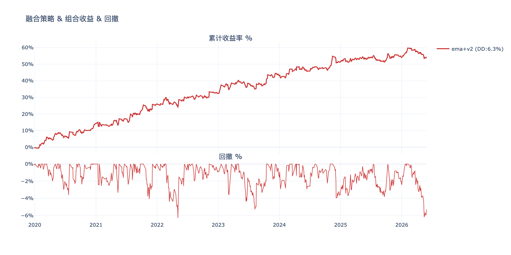
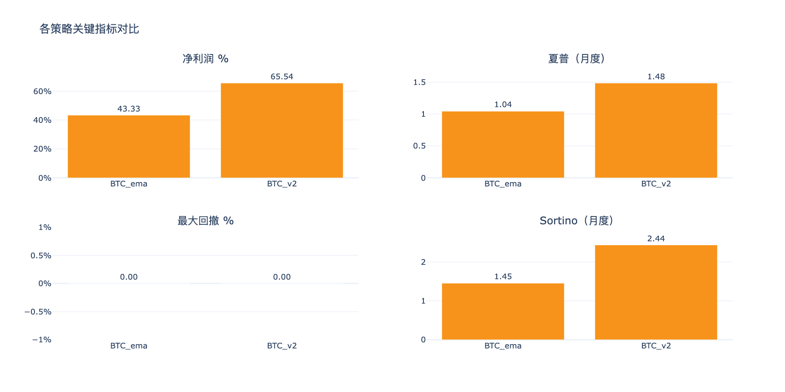
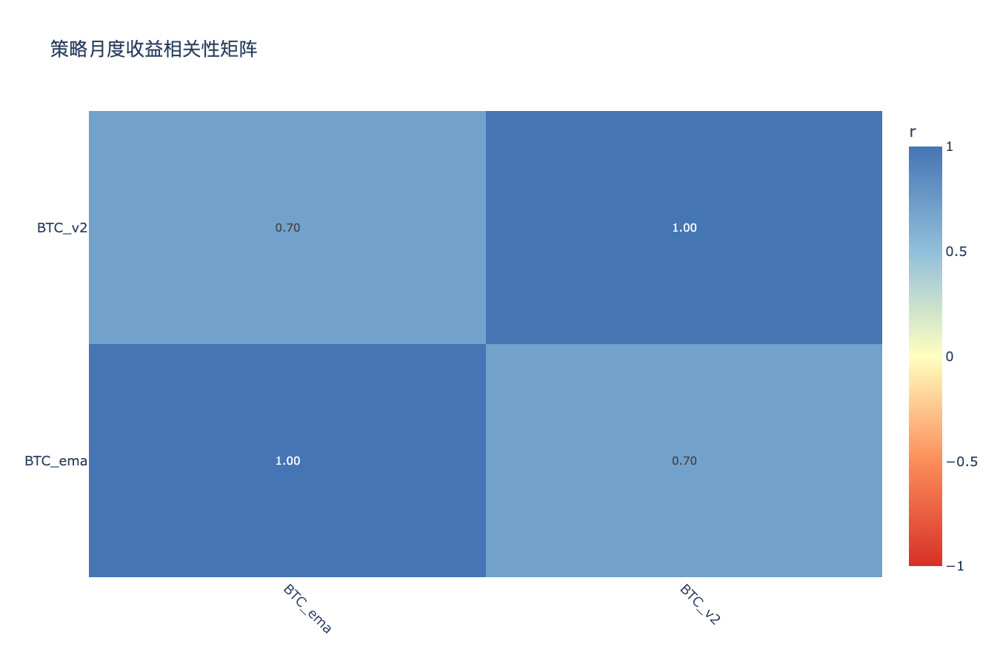

# BTC多版本策略分析 — 分析结论

生成时间：2026-06-10

---

## 收益曲线总览

## 组合收益 & 回撤

## 关键指标对比

## 相关性矩阵

---

## 各策略表现

| 策略 | 净利润 % | 年化收益 % | 夏普 | Sortino | 最大回撤 % | 月胜率 % |
|------|---------|-----------|------|---------|-----------|---------|
| BTC_ema | 43.3% | 5.7% | 1.04 | 1.45 | 6.9% | 54% |
| BTC_v2 | 65.5% | 8.1% | 1.48 | 2.44 | 5.8% | 61% |

## 年度收益分解

| 策略 | 2019 | 2020 | 2021 | 2022 | 2023 | 2024 | 2025 | 2026 |
|------|------|------|------|------|------|------|------|------|
| BTC_ema | -0.4% | +8.3% | +10.3% | +6.4% | +9.5% | +8.9% | +2.3% | -1.9% |
| BTC_v2 | -0.4% | +19.8% | +14.5% | +6.3% | +12.1% | +7.2% | +3.4% | +2.6% |

## 交易统计

| 策略 | 总交易数 | 胜率 % | 盈亏比 | 平均持仓K线 | 最大连续亏损 |
|------|---------|-------|-------|-----------|------------|
| BTC_ema | 921 | 31.8% | 2.66 | 7 | 14 |
| BTC_v2 | 711 | 31.5% | 3.24 | 8 | 14 |

## 组合对比（按最大回撤排序）

| 组合 | 净利润 % | 最大回撤 % | 夏普 | 回撤/收益 |
|------|---------|-----------|------|---------|
| ema+v2 | 54.4% | 6.3% | 1.33 | 0.12 |

## 策略相关性

**高相关策略对（|r| > 0.6，组合分散效果有限）：**

| 策略 A | 策略 B | 相关系数 |
|--------|--------|---------|
| BTC_ema | BTC_v2 | 0.701 |

## 关键发现

- **夏普最高**：BTC_v2（1.48）
- **回撤最小**：BTC_v2（5.8%）
- **最优组合（回撤最小）**：ema+v2（回撤 6.3%，净利润 54.4%）
- **注意**：BTC_ema×BTC_v2 相关性较高，同时持有分散效果有限

> 交互图表见同目录 HTML 文件。