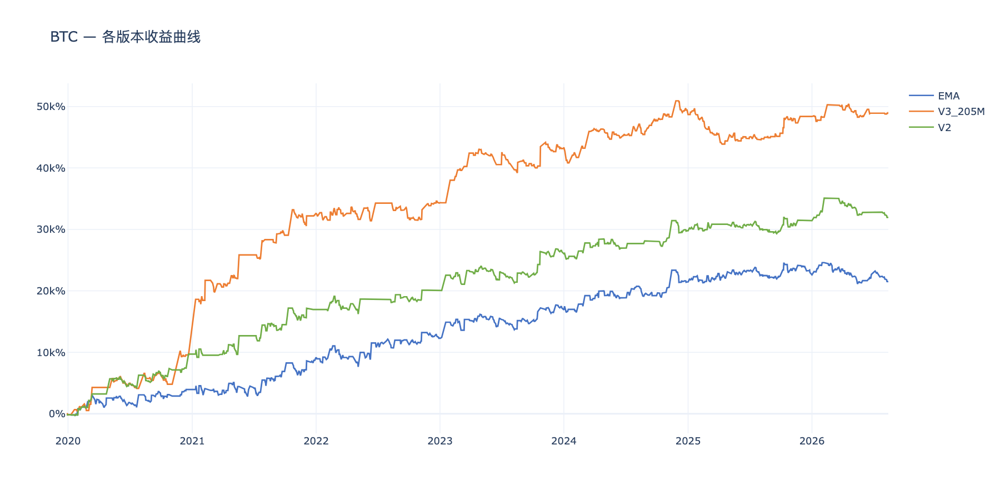
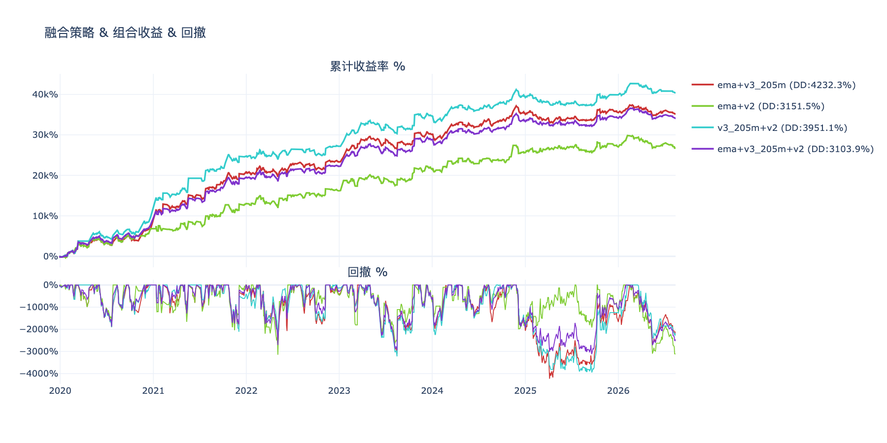
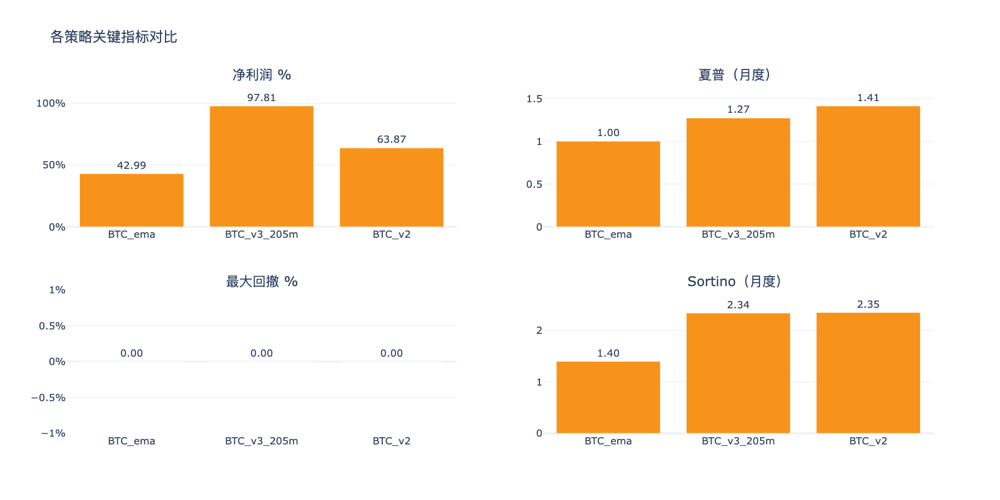
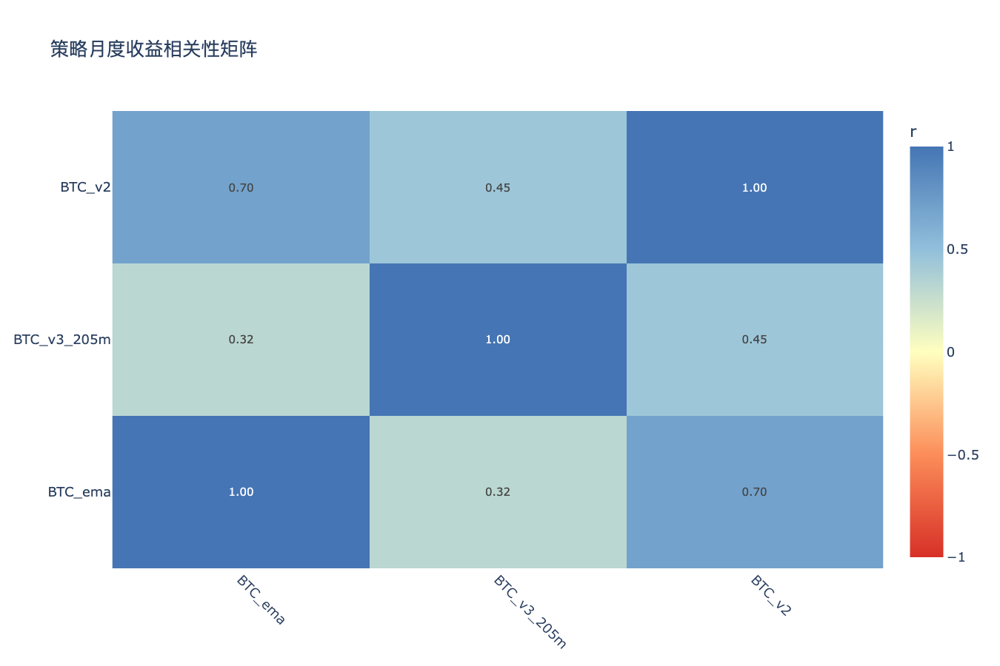

# BTC多版本策略分析 — 分析结论

生成时间：2026-08-14

---

## 收益曲线总览

## 组合收益 & 回撤

## 关键指标对比

## 相关性矩阵

---

## 各策略表现

| 策略 | 净利润 % | 年化收益 % | 夏普 | Sortino | 最大回撤 % | 月胜率 % |
|------|---------|-----------|------|---------|-----------|---------|
| BTC_ema | 21509.7% | 5.5% | 1.00 | 1.40 | 3448.6% | 53% |
| BTC_v2 | 31954.3% | 7.7% | 1.41 | 2.35 | 3156.2% | 59% |
| BTC_v3_205m | 49102.0% | 10.8% | 1.27 | 2.34 | 7033.5% | 60% |

## 年度收益分解

| 策略 | 2019 | 2020 | 2021 | 2022 | 2023 | 2024 | 2025 | 2026 |
|------|------|------|------|------|------|------|------|------|
| BTC_ema | -0.4% | +8.3% | +10.3% | +6.4% | +9.5% | +8.9% | +2.3% | -2.2% |
| BTC_v2 | -0.4% | +19.8% | +14.5% | +6.3% | +12.1% | +7.2% | +3.4% | +0.9% |
| BTC_v3_205m | — | +19.2% | +46.0% | +3.4% | +17.7% | +11.5% | -1.1% | +1.5% |

## 交易统计

| 策略 | 总交易数 | 胜率 % | 盈亏比 | 平均持仓K线 | 最大连续亏损 |
|------|---------|-------|-------|-----------|------------|
| BTC_ema | 958 | 31.7% | 2.65 | 7 | 14 |
| BTC_v2 | 729 | 31.3% | 3.23 | 8 | 14 |
| BTC_v3_205m | 987 | 23.9% | 4.91 | 17 | 21 |

## 组合对比（按最大回撤排序）

| 组合 | 净利润 % | 最大回撤 % | 夏普 | 回撤/收益 |
|------|---------|-----------|------|---------|
| ema+v3_205m+v2 | 34188.7% | 3103.9% | 1.48 | 0.09 |
| ema+v2 | 26732.0% | 3151.5% | 1.26 | 0.12 |
| v3_205m+v2 | 40528.2% | 3951.1% | 1.50 | 0.10 |
| ema+v3_205m | 35305.9% | 4232.3% | 1.38 | 0.12 |

## 策略相关性

**高相关策略对（|r| > 0.6，组合分散效果有限）：**

| 策略 A | 策略 B | 相关系数 |
|--------|--------|---------|
| BTC_ema | BTC_v2 | 0.698 |

**低相关策略对（|r| ≤ 0.6，适合组合）：**

| 策略 A | 策略 B | 相关系数 |
|--------|--------|---------|
| BTC_ema | BTC_v3_205m | 0.315 |
| BTC_v3_205m | BTC_v2 | 0.446 |

## 关键发现

- **夏普最高**：BTC_v2（1.41）
- **回撤最小**：BTC_v2（3156.2%）
- **最优组合（回撤最小）**：ema+v3_205m+v2（回撤 3103.9%，净利润 34188.7%）
- **注意**：BTC_ema×BTC_v2 相关性较高，同时持有分散效果有限

> 交互图表见同目录 HTML 文件。