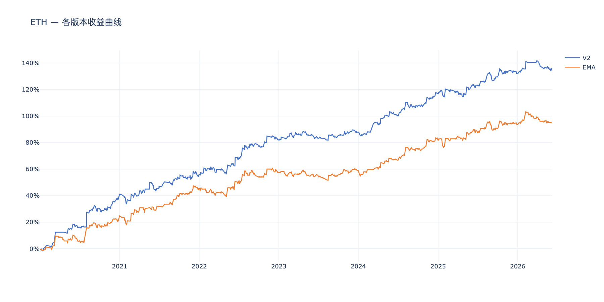
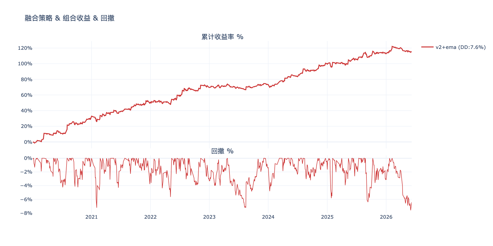
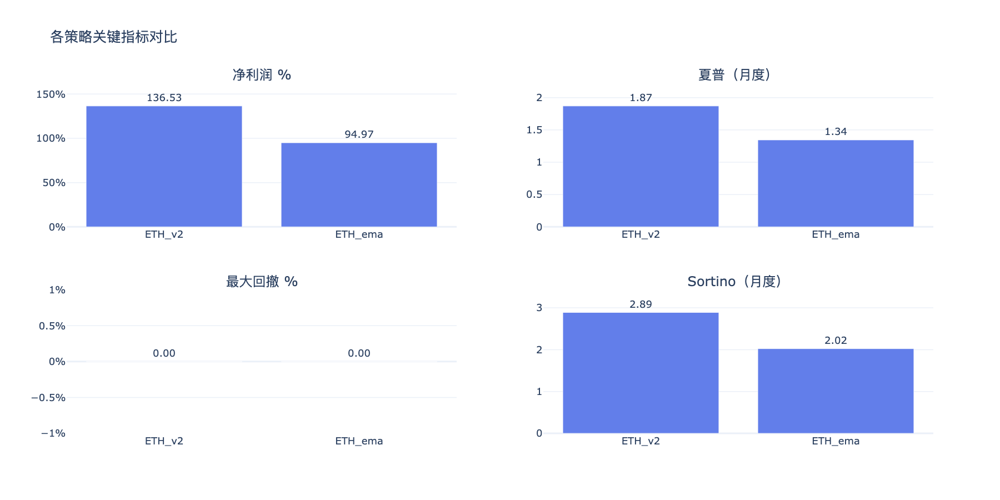
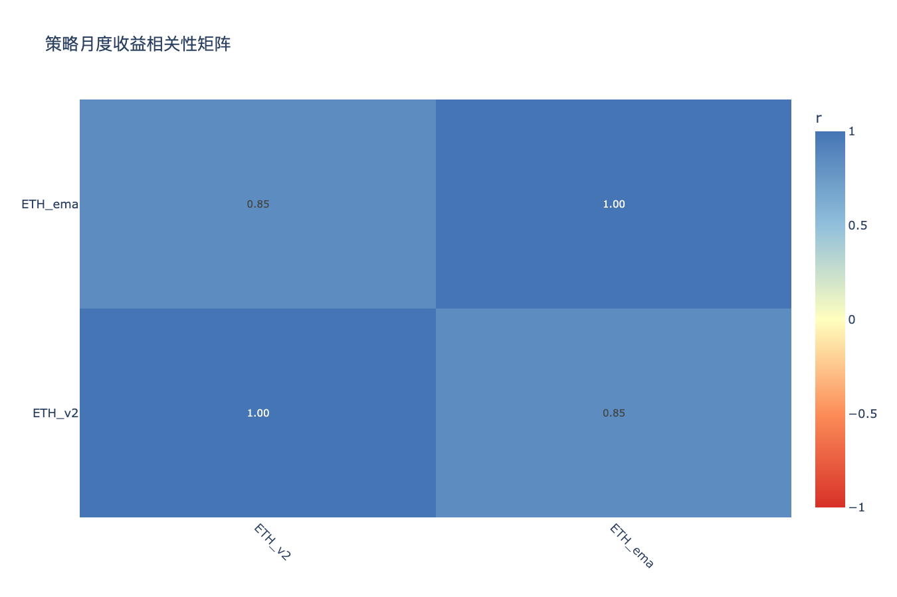

# ETH多版本策略分析 — 分析结论

生成时间：2026-06-10

---

## 收益曲线总览

## 组合收益 & 回撤

## 关键指标对比

## 相关性矩阵

---

## 各策略表现

| 策略 | 净利润 % | 年化收益 % | 夏普 | Sortino | 最大回撤 % | 月胜率 % |
|------|---------|-----------|------|---------|-----------|---------|
| ETH_ema | 95.0% | 10.9% | 1.34 | 2.02 | 9.0% | 63% |
| ETH_v2 | 136.5% | 14.2% | 1.87 | 2.89 | 7.5% | 68% |

## 年度收益分解

| 策略 | 2020 | 2021 | 2022 | 2023 | 2024 | 2025 | 2026 |
|------|------|------|------|------|------|------|------|
| ETH_ema | +20.8% | +25.1% | +11.4% | +1.4% | +23.3% | +11.6% | +1.3% |
| ETH_v2 | +37.1% | +18.8% | +26.0% | +5.8% | +29.1% | +15.1% | +4.6% |

## 交易统计

| 策略 | 总交易数 | 胜率 % | 盈亏比 | 平均持仓K线 | 最大连续亏损 |
|------|---------|-------|-------|-----------|------------|
| ETH_ema | 932 | 32.6% | 2.91 | 7 | 15 |
| ETH_v2 | 993 | 31.2% | 3.44 | 7 | 13 |

## 组合对比（按最大回撤排序）

| 组合 | 净利润 % | 最大回撤 % | 夏普 | 回撤/收益 |
|------|---------|-----------|------|---------|
| v2+ema | 115.8% | 7.6% | 1.67 | 0.07 |

## 策略相关性

**高相关策略对（|r| > 0.6，组合分散效果有限）：**

| 策略 A | 策略 B | 相关系数 |
|--------|--------|---------|
| ETH_v2 | ETH_ema | 0.846 |

## 关键发现

- **夏普最高**：ETH_v2（1.87）
- **回撤最小**：ETH_v2（7.5%）
- **最优组合（回撤最小）**：v2+ema（回撤 7.6%，净利润 115.8%）
- **注意**：ETH_v2×ETH_ema 相关性较高，同时持有分散效果有限

> 交互图表见同目录 HTML 文件。