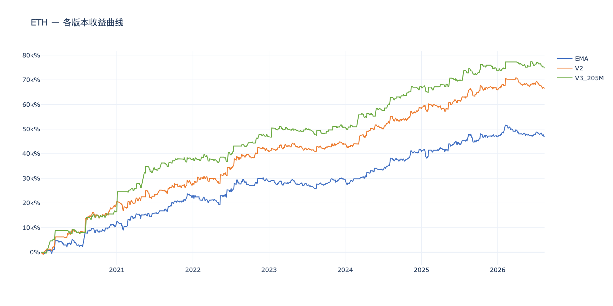
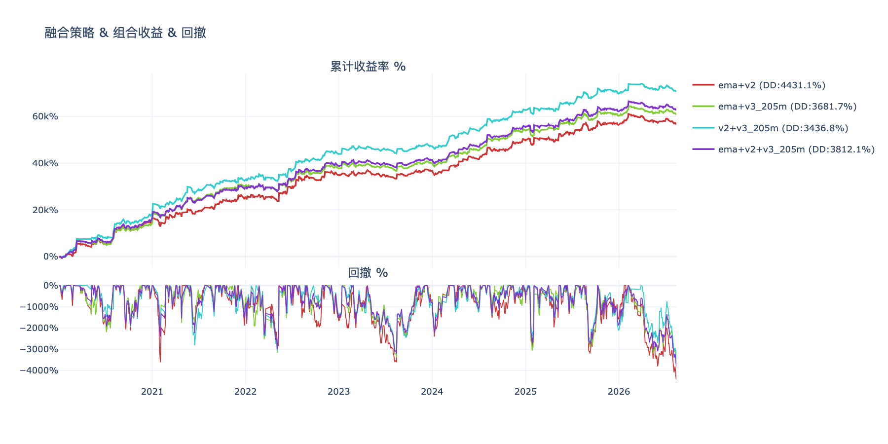
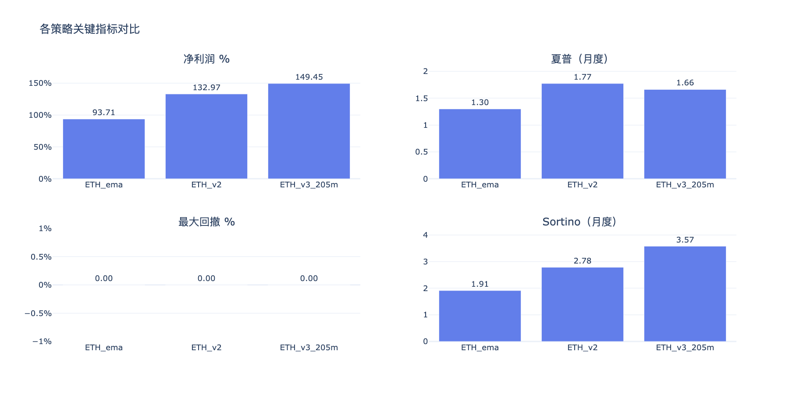
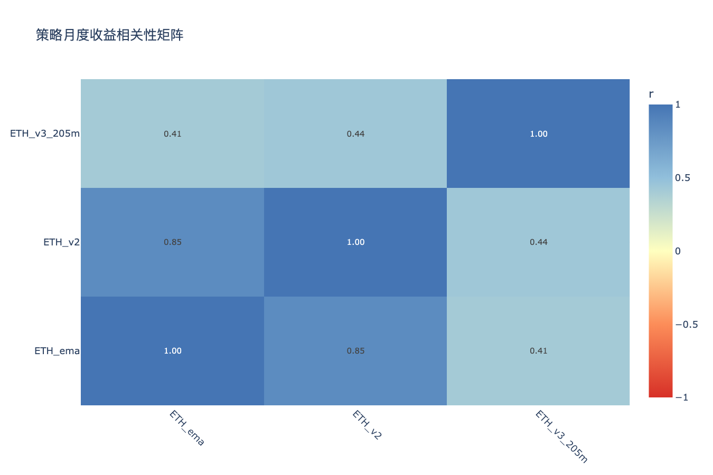

# ETH多版本策略分析 — 分析结论

生成时间：2026-08-14

---

## 收益曲线总览

## 组合收益 & 回撤

## 关键指标对比

## 相关性矩阵

---

## 各策略表现

| 策略 | 净利润 % | 年化收益 % | 夏普 | Sortino | 最大回撤 % | 月胜率 % |
|------|---------|-----------|------|---------|-----------|---------|
| ETH_ema | 46813.6% | 10.5% | 1.30 | 1.91 | 4789.3% | 64% |
| ETH_v2 | 66488.5% | 13.6% | 1.77 | 2.78 | 4299.7% | 66% |
| ETH_v3_205m | 74687.3% | 14.8% | 1.66 | 3.57 | 3640.9% | 62% |

## 年度收益分解

| 策略 | 2020 | 2021 | 2022 | 2023 | 2024 | 2025 | 2026 |
|------|------|------|------|------|------|------|------|
| ETH_ema | +20.8% | +25.1% | +11.4% | +1.4% | +23.3% | +11.6% | -0.0% |
| ETH_v2 | +37.1% | +18.8% | +26.0% | +5.8% | +29.1% | +15.1% | +1.1% |
| ETH_v3_205m | +32.8% | +42.7% | +18.2% | +7.9% | +32.9% | +13.0% | +2.0% |

## 交易统计

| 策略 | 总交易数 | 胜率 % | 盈亏比 | 平均持仓K线 | 最大连续亏损 |
|------|---------|-------|-------|-----------|------------|
| ETH_ema | 970 | 32.7% | 2.86 | 7 | 15 |
| ETH_v2 | 1034 | 31.0% | 3.39 | 7 | 13 |
| ETH_v3_205m | 891 | 25.2% | 5.43 | 15 | 22 |

## 组合对比（按最大回撤排序）

| 组合 | 净利润 % | 最大回撤 % | 夏普 | 回撤/收益 |
|------|---------|-----------|------|---------|
| v2+v3_205m | 70587.9% | 3436.8% | 2.01 | 0.05 |
| ema+v3_205m | 60750.5% | 3681.7% | 1.76 | 0.06 |
| ema+v2+v3_205m | 62663.2% | 3812.1% | 1.88 | 0.06 |
| ema+v2 | 56651.1% | 4431.1% | 1.60 | 0.08 |

## 策略相关性

**高相关策略对（|r| > 0.6，组合分散效果有限）：**

| 策略 A | 策略 B | 相关系数 |
|--------|--------|---------|
| ETH_ema | ETH_v2 | 0.846 |

**低相关策略对（|r| ≤ 0.6，适合组合）：**

| 策略 A | 策略 B | 相关系数 |
|--------|--------|---------|
| ETH_ema | ETH_v3_205m | 0.414 |
| ETH_v2 | ETH_v3_205m | 0.437 |

## 关键发现

- **夏普最高**：ETH_v2（1.77）
- **回撤最小**：ETH_v3_205m（3640.9%）
- **最优组合（回撤最小）**：v2+v3_205m（回撤 3436.8%，净利润 70587.9%）
- **注意**：ETH_ema×ETH_v2 相关性较高，同时持有分散效果有限

> 交互图表见同目录 HTML 文件。