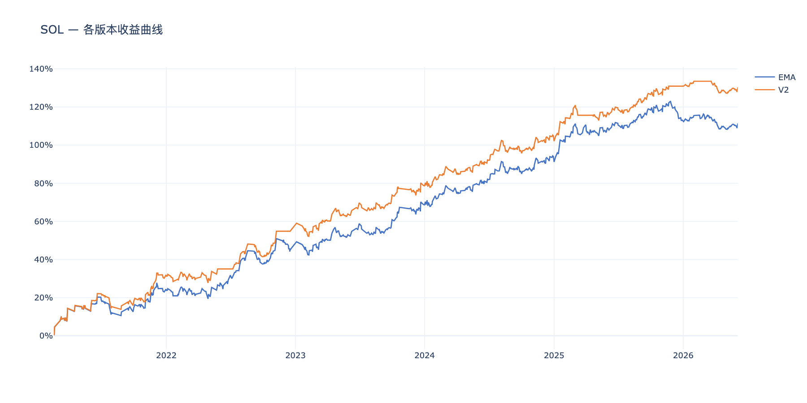
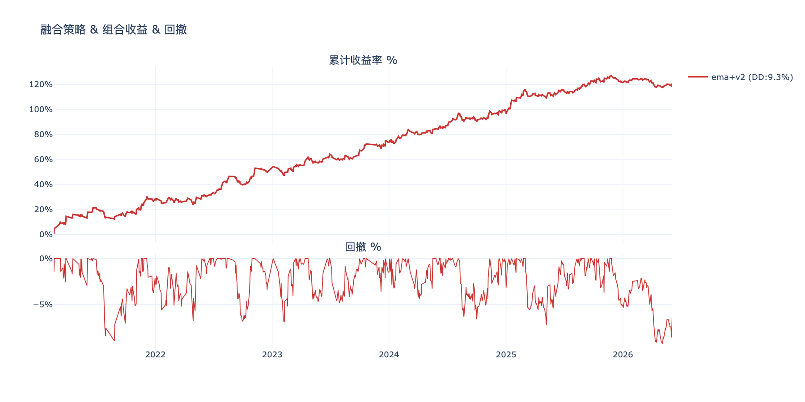
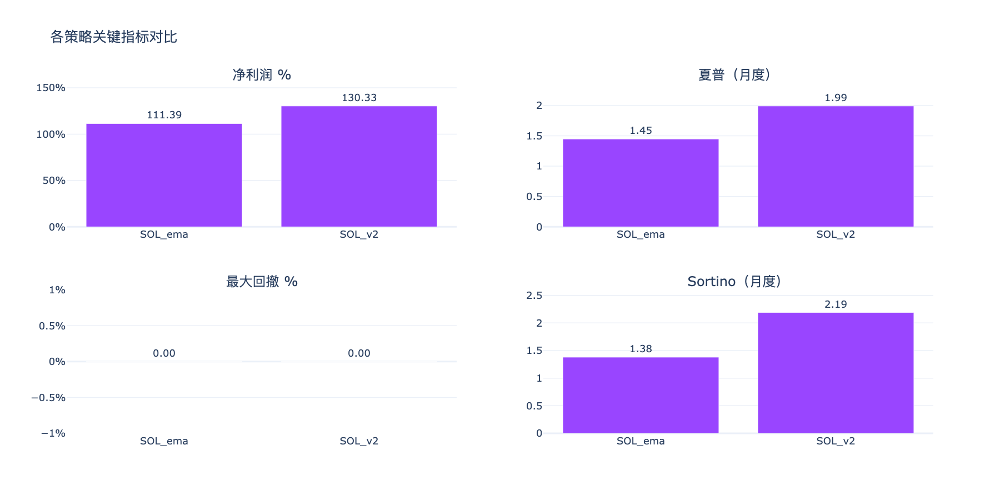
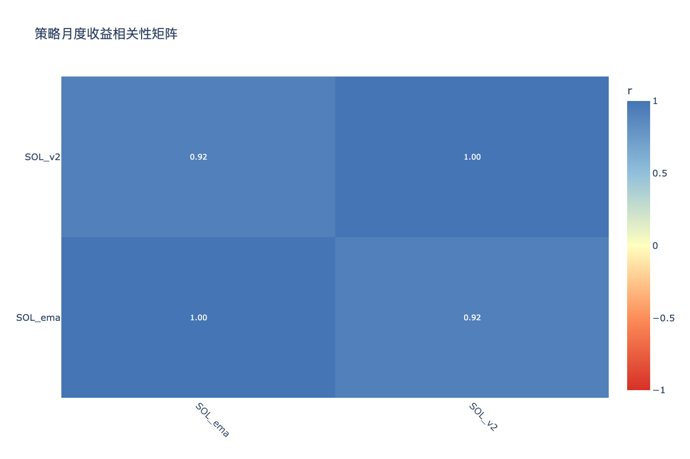

# SOL多版本策略分析 — 分析结论

生成时间：2026-06-10

---

## 收益曲线总览

## 组合收益 & 回撤

## 关键指标对比

## 相关性矩阵

---

## 各策略表现

| 策略 | 净利润 % | 年化收益 % | 夏普 | Sortino | 最大回撤 % | 月胜率 % |
|------|---------|-----------|------|---------|-----------|---------|
| SOL_ema | 111.4% | 14.9% | 1.45 | 1.38 | 14.8% | 75% |
| SOL_v2 | 130.3% | 16.8% | 1.99 | 2.19 | 8.3% | 77% |

## 年度收益分解

| 策略 | 2021 | 2022 | 2023 | 2024 | 2025 | 2026 |
|------|------|------|------|------|------|------|
| SOL_ema | +24.5% | +20.6% | +23.7% | +23.6% | +20.4% | -1.4% |
| SOL_v2 | +31.9% | +22.9% | +23.9% | +24.5% | +27.6% | -0.6% |

## 交易统计

| 策略 | 总交易数 | 胜率 % | 盈亏比 | 平均持仓K线 | 最大连续亏损 |
|------|---------|-------|-------|-----------|------------|
| SOL_ema | 977 | 37.5% | 2.27 | 6 | 13 |
| SOL_v2 | 844 | 38.4% | 2.41 | 6 | 13 |

## 组合对比（按最大回撤排序）

| 组合 | 净利润 % | 最大回撤 % | 夏普 | 回撤/收益 |
|------|---------|-----------|------|---------|
| ema+v2 | 120.9% | 9.3% | 1.70 | 0.08 |

## 策略相关性

**高相关策略对（|r| > 0.6，组合分散效果有限）：**

| 策略 A | 策略 B | 相关系数 |
|--------|--------|---------|
| SOL_ema | SOL_v2 | 0.923 |

## 关键发现

- **夏普最高**：SOL_v2（1.99）
- **回撤最小**：SOL_v2（8.3%）
- **最优组合（回撤最小）**：ema+v2（回撤 9.3%，净利润 120.9%）
- **注意**：SOL_ema×SOL_v2 相关性较高，同时持有分散效果有限

> 交互图表见同目录 HTML 文件。