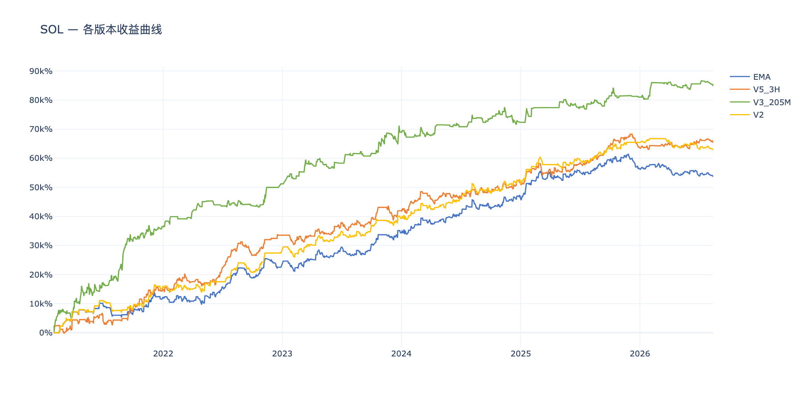
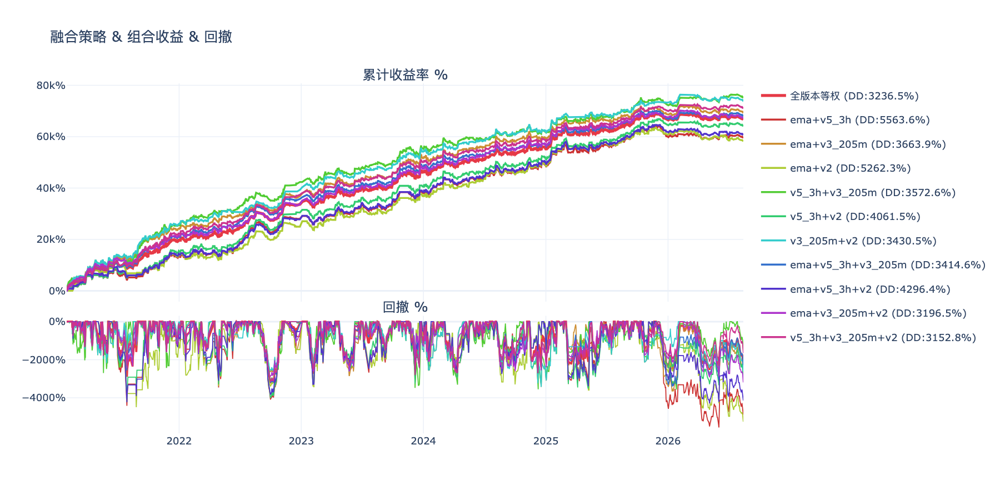
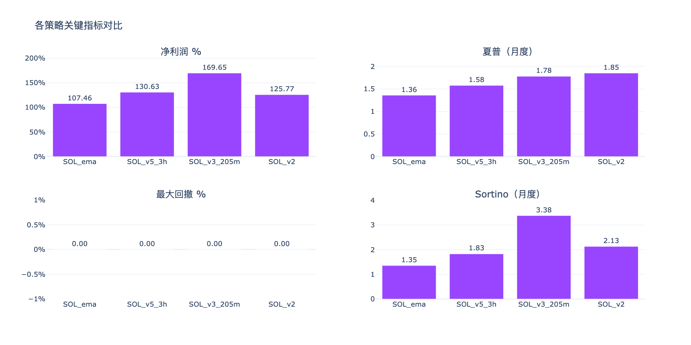
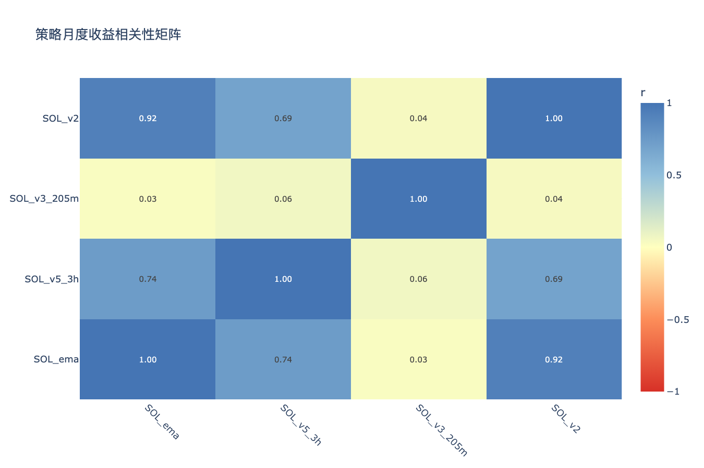

# SOL多版本策略分析 — 分析结论

生成时间：2026-08-14

---

## 收益曲线总览

## 组合收益 & 回撤

## 关键指标对比

## 相关性矩阵

---

## 各策略表现

| 策略 | 净利润 % | 年化收益 % | 夏普 | Sortino | 最大回撤 % | 月胜率 % |
|------|---------|-----------|------|---------|-----------|---------|
| SOL_ema | 53654.0% | 14.0% | 1.36 | 1.35 | 7875.9% | 73% |
| SOL_v2 | 62806.5% | 15.8% | 1.85 | 2.13 | 4132.5% | 75% |
| SOL_v3_205m | 84737.0% | 19.5% | 1.78 | 3.38 | 6044.4% | 66% |
| SOL_v5_3h | 65307.3% | 16.2% | 1.58 | 1.83 | 5260.0% | 69% |

## 年度收益分解

| 策略 | 2021 | 2022 | 2023 | 2024 | 2025 | 2026 |
|------|------|------|------|------|------|------|
| SOL_ema | +24.5% | +20.6% | +23.7% | +23.6% | +20.4% | -5.5% |
| SOL_v2 | +31.9% | +22.9% | +23.9% | +24.5% | +27.6% | -5.3% |
| SOL_v3_205m | +72.8% | +29.5% | +35.6% | +6.8% | +17.3% | +7.4% |
| SOL_v5_3h | +30.3% | +36.8% | +16.8% | +18.4% | +25.0% | +3.3% |

## 交易统计

| 策略 | 总交易数 | 胜率 % | 盈亏比 | 平均持仓K线 | 最大连续亏损 |
|------|---------|-------|-------|-----------|------------|
| SOL_ema | 1027 | 37.1% | 2.26 | 6 | 13 |
| SOL_v2 | 894 | 37.9% | 2.39 | 6 | 13 |
| SOL_v3_205m | 980 | 31.3% | 3.29 | 13 | 16 |
| SOL_v5_3h | 1575 | 31.3% | 2.90 | 9 | 24 |

## 组合对比（按最大回撤排序）

| 组合 | 净利润 % | 最大回撤 % | 夏普 | 回撤/收益 |
|------|---------|-----------|------|---------|
| v5_3h+v3_205m+v2 | 70950.3% | 3152.8% | 2.42 | 0.04 |
| ema+v3_205m+v2 | 67065.8% | 3196.5% | 2.27 | 0.05 |
| 全版本等权 | 66626.2% | 3236.5% | 2.22 | 0.05 |
| ema+v5_3h+v3_205m | 67899.4% | 3414.6% | 2.22 | 0.05 |
| v3_205m+v2 | 73771.8% | 3430.5% | 2.44 | 0.05 |
| v5_3h+v3_205m | 75022.1% | 3572.6% | 2.29 | 0.05 |
| ema+v3_205m | 69195.5% | 3663.9% | 2.21 | 0.05 |
| v5_3h+v2 | 64056.9% | 4061.5% | 1.81 | 0.06 |
| ema+v5_3h+v2 | 60589.3% | 4296.4% | 1.68 | 0.07 |
| ema+v2 | 58230.3% | 5262.3% | 1.59 | 0.09 |
| ema+v5_3h | 59480.6% | 5563.6% | 1.57 | 0.09 |

## 策略相关性

**高相关策略对（|r| > 0.6，组合分散效果有限）：**

| 策略 A | 策略 B | 相关系数 |
|--------|--------|---------|
| SOL_ema | SOL_v2 | 0.924 |
| SOL_ema | SOL_v5_3h | 0.738 |
| SOL_v5_3h | SOL_v2 | 0.690 |

**低相关策略对（|r| ≤ 0.6，适合组合）：**

| 策略 A | 策略 B | 相关系数 |
|--------|--------|---------|
| SOL_ema | SOL_v3_205m | 0.027 |
| SOL_v3_205m | SOL_v2 | 0.043 |
| SOL_v5_3h | SOL_v3_205m | 0.064 |

## 关键发现

- **夏普最高**：SOL_v2（1.85）
- **回撤最小**：SOL_v2（4132.5%）
- **最优组合（回撤最小）**：v5_3h+v3_205m+v2（回撤 3152.8%，净利润 70950.3%）
- **注意**：SOL_ema×SOL_v2、SOL_ema×SOL_v5_3h、SOL_v5_3h×SOL_v2 相关性较高，同时持有分散效果有限

> 交互图表见同目录 HTML 文件。