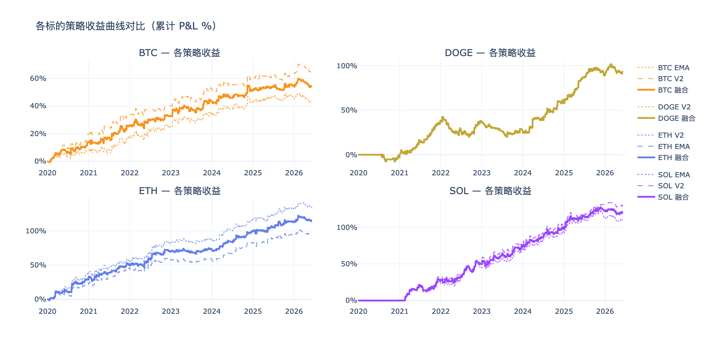
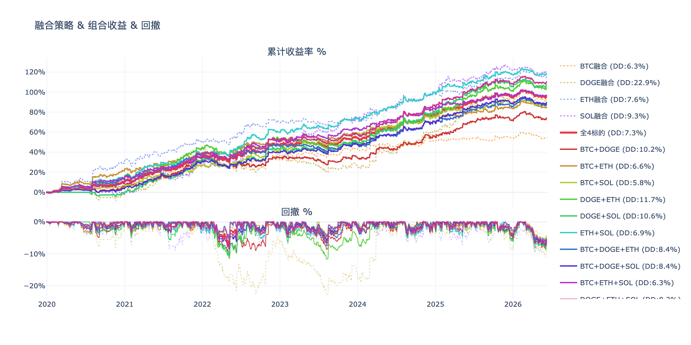
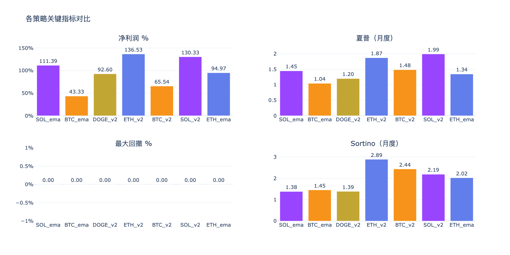
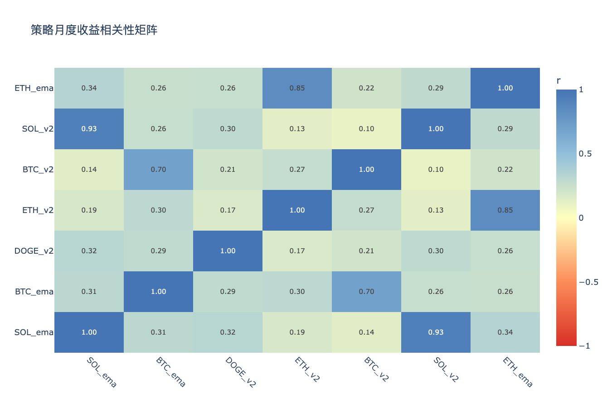

# 多标的策略分析 — 分析结论

生成时间：2026-06-10

---

## 收益曲线总览

## 组合收益 & 回撤

## 关键指标对比

## 相关性矩阵

---

## 各策略表现

| 策略 | 净利润 % | 年化收益 % | 夏普 | Sortino | 最大回撤 % | 月胜率 % |
|------|---------|-----------|------|---------|-----------|---------|
| BTC_ema | 43.3% | 5.7% | 1.04 | 1.45 | 6.9% | 54% |
| BTC_v2 | 65.5% | 8.1% | 1.48 | 2.44 | 5.8% | 61% |
| DOGE_v2 | 92.3% | 11.7% | 1.20 | 1.39 | 22.9% | 65% |
| ETH_ema | 95.0% | 10.9% | 1.34 | 2.02 | 9.0% | 63% |
| ETH_v2 | 136.5% | 14.2% | 1.87 | 2.89 | 7.5% | 68% |
| SOL_ema | 111.4% | 14.9% | 1.45 | 1.38 | 14.8% | 75% |
| SOL_v2 | 130.3% | 16.8% | 1.99 | 2.19 | 8.3% | 77% |

## 年度收益分解

| 策略 | 2019 | 2020 | 2021 | 2022 | 2023 | 2024 | 2025 | 2026 |
|------|------|------|------|------|------|------|------|------|
| BTC_ema | -0.4% | +8.3% | +10.3% | +6.4% | +9.5% | +8.9% | +2.3% | -1.9% |
| BTC_v2 | -0.4% | +19.8% | +14.5% | +6.3% | +12.1% | +7.2% | +3.4% | +2.6% |
| DOGE_v2 | — | -2.9% | +41.8% | -2.1% | -10.4% | +32.3% | +30.7% | +2.8% |
| ETH_ema | — | +20.8% | +25.1% | +11.4% | +1.4% | +23.3% | +11.6% | +1.3% |
| ETH_v2 | — | +37.1% | +18.8% | +26.0% | +5.8% | +29.1% | +15.1% | +4.6% |
| SOL_ema | — | — | +24.5% | +20.6% | +23.7% | +23.6% | +20.4% | -1.4% |
| SOL_v2 | — | — | +31.9% | +22.9% | +23.9% | +24.5% | +27.6% | -0.6% |

## 交易统计

| 策略 | 总交易数 | 胜率 % | 盈亏比 | 平均持仓K线 | 最大连续亏损 |
|------|---------|-------|-------|-----------|------------|
| BTC_ema | 921 | 31.8% | 2.66 | 7 | 14 |
| BTC_v2 | 711 | 31.5% | 3.24 | 8 | 14 |
| DOGE_v2 | 1168 | 32.6% | 2.66 | 6 | 18 |
| ETH_ema | 932 | 32.6% | 2.91 | 7 | 15 |
| ETH_v2 | 993 | 31.2% | 3.44 | 7 | 13 |
| SOL_ema | 977 | 37.5% | 2.27 | 6 | 13 |
| SOL_v2 | 844 | 38.4% | 2.41 | 6 | 13 |

## 各标的融合表现

| 组合 | 净利润 % | 最大回撤 % | 夏普 | Sortino |
|------|---------|-----------|------|---------|
| BTC融合 | 54.4% | 6.3% | 1.33 | 1.94 |
| DOGE融合 | 92.3% | 22.9% | 1.20 | 1.39 |
| ETH融合 | 115.8% | 7.6% | 1.67 | 2.87 |
| SOL融合 | 120.9% | 9.3% | 1.70 | 1.83 |

## 组合对比（按最大回撤排序）

| 组合 | 净利润 % | 最大回撤 % | 夏普 | 回撤/收益 |
|------|---------|-----------|------|---------|
| BTC+SOL | 87.6% | 5.8% | 1.79 | 0.07 |
| BTC融合 | 54.4% | 6.3% | 1.33 | 0.12 |
| BTC+ETH+SOL | 97.0% | 6.3% | 2.11 | 0.07 |
| BTC+ETH | 85.1% | 6.6% | 1.87 | 0.08 |
| ETH+SOL | 118.3% | 6.9% | 2.01 | 0.06 |
| 全4标的 | 95.8% | 7.3% | 2.08 | 0.08 |
| ETH融合 | 115.8% | 7.6% | 1.67 | 0.07 |
| DOGE+ETH+SOL | 109.6% | 8.2% | 2.01 | 0.07 |
| BTC+DOGE+ETH | 87.5% | 8.4% | 1.89 | 0.10 |
| BTC+DOGE+SOL | 89.2% | 8.4% | 1.80 | 0.09 |
| SOL融合 | 120.9% | 9.3% | 1.70 | 0.08 |
| BTC+DOGE | 73.4% | 10.2% | 1.46 | 0.14 |
| DOGE+SOL | 106.6% | 10.6% | 1.73 | 0.10 |
| DOGE+ETH | 104.0% | 11.7% | 1.77 | 0.11 |
| DOGE融合 | 92.3% | 22.9% | 1.20 | 0.25 |

## 策略相关性

**高相关策略对（|r| > 0.6，组合分散效果有限）：**

| 策略 A | 策略 B | 相关系数 |
|--------|--------|---------|
| SOL_ema | SOL_v2 | 0.925 |
| ETH_v2 | ETH_ema | 0.846 |
| BTC_ema | BTC_v2 | 0.701 |

**低相关策略对（|r| ≤ 0.6，适合组合）：**

| 策略 A | 策略 B | 相关系数 |
|--------|--------|---------|
| BTC_v2 | SOL_v2 | 0.099 |
| ETH_v2 | SOL_v2 | 0.129 |
| SOL_ema | BTC_v2 | 0.141 |
| DOGE_v2 | ETH_v2 | 0.170 |
| SOL_ema | ETH_v2 | 0.188 |
| DOGE_v2 | BTC_v2 | 0.214 |
| BTC_v2 | ETH_ema | 0.219 |
| BTC_ema | ETH_ema | 0.255 |

## 关键发现

- **夏普最高**：SOL_v2（1.99）
- **回撤最小**：BTC_v2（5.8%）
- **最优组合（回撤最小）**：BTC+SOL（回撤 5.8%，净利润 87.6%）
- **注意**：SOL_ema×SOL_v2、ETH_v2×ETH_ema、BTC_ema×BTC_v2 相关性较高，同时持有分散效果有限

> 交互图表见同目录 HTML 文件。