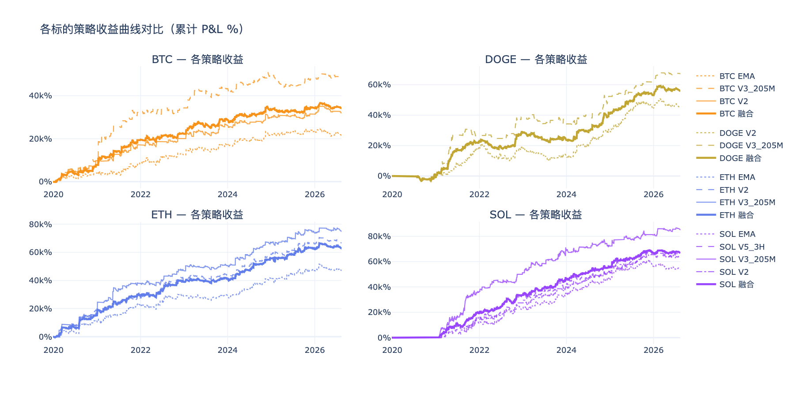
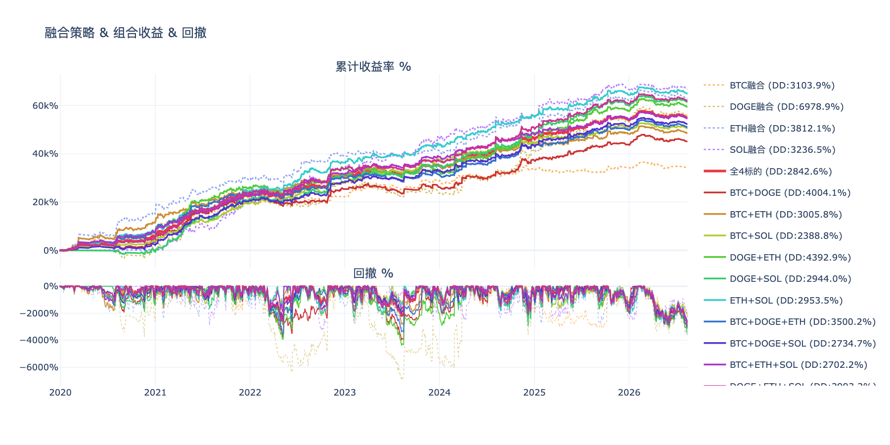
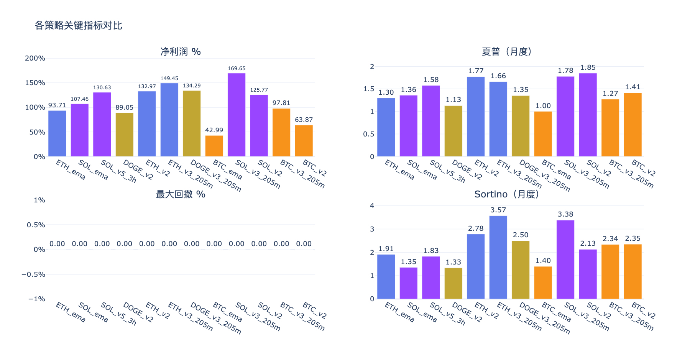
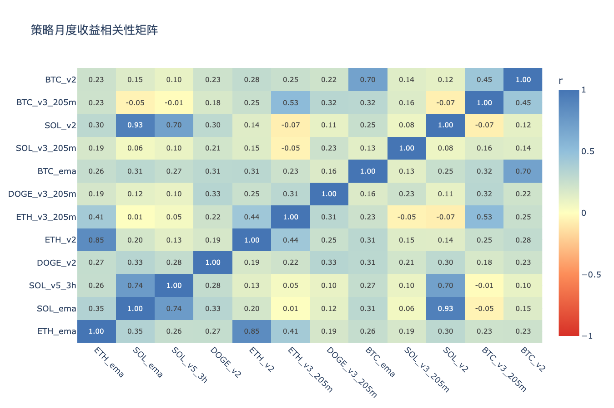

# 多标的策略分析 — 分析结论

生成时间：2026-08-14

---

## 收益曲线总览

## 组合收益 & 回撤

## 关键指标对比

## 相关性矩阵

---

## 各策略表现

| 策略 | 净利润 % | 年化收益 % | 夏普 | Sortino | 最大回撤 % | 月胜率 % |
|------|---------|-----------|------|---------|-----------|---------|
| BTC_ema | 21509.7% | 5.5% | 1.00 | 1.40 | 3448.6% | 53% |
| BTC_v2 | 31954.3% | 7.7% | 1.41 | 2.35 | 3156.2% | 59% |
| BTC_v3_205m | 49102.0% | 10.8% | 1.27 | 2.34 | 7033.5% | 60% |
| DOGE_v2 | 44639.8% | 11.0% | 1.13 | 1.33 | 11435.0% | 64% |
| DOGE_v3_205m | 67172.9% | 15.0% | 1.35 | 2.50 | 7923.2% | 55% |
| ETH_ema | 46813.6% | 10.5% | 1.30 | 1.91 | 4789.3% | 64% |
| ETH_v2 | 66488.5% | 13.6% | 1.77 | 2.78 | 4299.7% | 66% |
| ETH_v3_205m | 74687.3% | 14.8% | 1.66 | 3.57 | 3640.9% | 62% |
| SOL_ema | 53654.0% | 14.0% | 1.36 | 1.35 | 7875.9% | 73% |
| SOL_v2 | 62806.5% | 15.8% | 1.85 | 2.13 | 4132.5% | 75% |
| SOL_v3_205m | 84737.0% | 19.5% | 1.78 | 3.38 | 6044.4% | 66% |
| SOL_v5_3h | 65307.3% | 16.2% | 1.58 | 1.83 | 5260.0% | 69% |

## 年度收益分解

| 策略 | 2019 | 2020 | 2021 | 2022 | 2023 | 2024 | 2025 | 2026 |
|------|------|------|------|------|------|------|------|------|
| BTC_ema | -0.4% | +8.3% | +10.3% | +6.4% | +9.5% | +8.9% | +2.3% | -2.2% |
| BTC_v2 | -0.4% | +19.8% | +14.5% | +6.3% | +12.1% | +7.2% | +3.4% | +0.9% |
| BTC_v3_205m | — | +19.2% | +46.0% | +3.4% | +17.7% | +11.5% | -1.1% | +1.5% |
| DOGE_v2 | — | -2.9% | +41.8% | -2.1% | -10.4% | +32.3% | +30.7% | -0.2% |
| DOGE_v3_205m | — | -1.9% | +54.5% | +25.6% | -9.9% | +36.3% | +19.0% | +10.8% |
| ETH_ema | — | +20.8% | +25.1% | +11.4% | +1.4% | +23.3% | +11.6% | -0.0% |
| ETH_v2 | — | +37.1% | +18.8% | +26.0% | +5.8% | +29.1% | +15.1% | +1.1% |
| ETH_v3_205m | — | +32.8% | +42.7% | +18.2% | +7.9% | +32.9% | +13.0% | +2.0% |
| SOL_ema | — | — | +24.5% | +20.6% | +23.7% | +23.6% | +20.4% | -5.5% |
| SOL_v2 | — | — | +31.9% | +22.9% | +23.9% | +24.5% | +27.6% | -5.3% |
| SOL_v3_205m | — | — | +72.8% | +29.5% | +35.6% | +6.8% | +17.3% | +7.4% |
| SOL_v5_3h | — | — | +30.3% | +36.8% | +16.8% | +18.4% | +25.0% | +3.3% |

## 交易统计

| 策略 | 总交易数 | 胜率 % | 盈亏比 | 平均持仓K线 | 最大连续亏损 |
|------|---------|-------|-------|-----------|------------|
| BTC_ema | 958 | 31.7% | 2.65 | 7 | 14 |
| BTC_v2 | 729 | 31.3% | 3.23 | 8 | 14 |
| BTC_v3_205m | 987 | 23.9% | 4.91 | 17 | 21 |
| DOGE_v2 | 1217 | 32.4% | 2.65 | 6 | 18 |
| DOGE_v3_205m | 804 | 28.9% | 3.73 | 11 | 15 |
| ETH_ema | 970 | 32.7% | 2.86 | 7 | 15 |
| ETH_v2 | 1034 | 31.0% | 3.39 | 7 | 13 |
| ETH_v3_205m | 891 | 25.2% | 5.43 | 15 | 22 |
| SOL_ema | 1027 | 37.1% | 2.26 | 6 | 13 |
| SOL_v2 | 894 | 37.9% | 2.39 | 6 | 13 |
| SOL_v3_205m | 980 | 31.3% | 3.29 | 13 | 16 |
| SOL_v5_3h | 1575 | 31.3% | 2.90 | 9 | 24 |

## 各标的融合表现

| 组合 | 净利润 % | 最大回撤 % | 夏普 | Sortino |
|------|---------|-----------|------|---------|
| BTC融合 | 34188.7% | 3103.9% | 1.48 | 2.55 |
| DOGE融合 | 55906.4% | 6978.9% | 1.54 | 2.23 |
| ETH融合 | 62663.2% | 3812.1% | 1.88 | 3.33 |
| SOL融合 | 66626.2% | 3236.5% | 2.22 | 2.68 |

## 组合对比（按最大回撤排序）

| 组合 | 净利润 % | 最大回撤 % | 夏普 | 回撤/收益 |
|------|---------|-----------|------|---------|
| BTC+SOL | 50407.4% | 2388.8% | 2.28 | 0.05 |
| BTC+ETH+SOL | 54492.7% | 2702.2% | 2.51 | 0.05 |
| BTC+DOGE+SOL | 52240.4% | 2734.7% | 2.23 | 0.05 |
| 全4标的 | 54846.1% | 2842.6% | 2.43 | 0.05 |
| DOGE+SOL | 61266.3% | 2944.0% | 2.21 | 0.05 |
| ETH+SOL | 64644.7% | 2953.5% | 2.50 | 0.05 |
| DOGE+ETH+SOL | 61731.9% | 2993.2% | 2.42 | 0.05 |
| BTC+ETH | 48425.9% | 3005.8% | 2.00 | 0.06 |
| BTC融合 | 34188.7% | 3103.9% | 1.48 | 0.09 |
| SOL融合 | 66626.2% | 3236.5% | 2.22 | 0.05 |
| BTC+DOGE+ETH | 50919.4% | 3500.2% | 2.08 | 0.07 |
| ETH融合 | 62663.2% | 3812.1% | 1.88 | 0.06 |
| BTC+DOGE | 45047.5% | 4004.1% | 1.75 | 0.09 |
| DOGE+ETH | 59284.8% | 4392.9% | 2.02 | 0.07 |
| DOGE融合 | 55906.4% | 6978.9% | 1.54 | 0.12 |

## 策略相关性

**高相关策略对（|r| > 0.6，组合分散效果有限）：**

| 策略 A | 策略 B | 相关系数 |
|--------|--------|---------|
| SOL_ema | SOL_v2 | 0.926 |
| ETH_ema | ETH_v2 | 0.846 |
| SOL_ema | SOL_v5_3h | 0.745 |
| SOL_v5_3h | SOL_v2 | 0.701 |
| BTC_ema | BTC_v2 | 0.698 |

**低相关策略对（|r| ≤ 0.6，适合组合）：**

| 策略 A | 策略 B | 相关系数 |
|--------|--------|---------|
| SOL_ema | ETH_v3_205m | 0.011 |
| SOL_v5_3h | BTC_v3_205m | -0.013 |
| SOL_v5_3h | ETH_v3_205m | 0.048 |
| SOL_ema | BTC_v3_205m | -0.051 |
| ETH_v3_205m | SOL_v3_205m | -0.051 |
| SOL_ema | SOL_v3_205m | 0.057 |
| SOL_v2 | BTC_v3_205m | -0.067 |
| ETH_v3_205m | SOL_v2 | -0.071 |

## 关键发现

- **夏普最高**：SOL_v2（1.85）
- **回撤最小**：BTC_v2（3156.2%）
- **最优组合（回撤最小）**：BTC+SOL（回撤 2388.8%，净利润 50407.4%）
- **注意**：SOL_ema×SOL_v2、ETH_ema×ETH_v2、SOL_ema×SOL_v5_3h 相关性较高，同时持有分散效果有限

> 交互图表见同目录 HTML 文件。